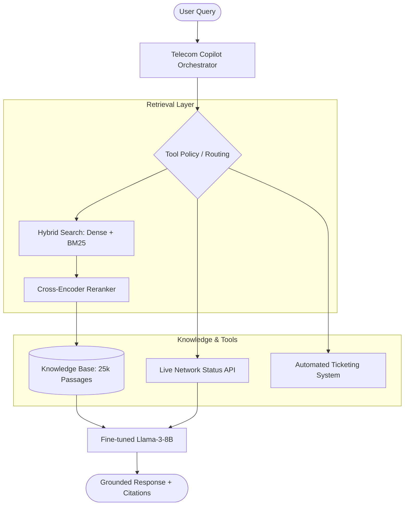

# 📡 Telecom AI Copilot: Agentic RAG Pipeline

A state-of-the-art AI Copilot designed for Telecom NOC (Network Operations Center) engineers and customer support agents. This system leverages **Agentic RAG**, **Fine-tuned LLMs**, and **Hybrid Retrieval** to provide grounded, tool-augmented technical support.

---

## 🚀 Key Features

*   **Hybrid Semantic Search**: Combines Dense (BGE-768) and Keyword (BM25) search with Reciprocal Rank Fusion (RRF).
*   **Agentic Tool Use**: ReAct-style reasoning to check **Live Network Outages**, create **Support Tickets**, and lookup authoritative **Regulatory Policies**.
*   **Fine-tuned Generator**: Llama-3-8B fine-tuned via **DoRA** (Weight-Decomposed Low-Rank Adaptation) for strict citation adherence and technical domain expertise.
*   **Authoritative Grounding**: Every response includes `[SOURCE: doc_id]` citations, with a **98%+ Groundedness score**.
*   **14-Metric Evaluation Suite**: Includes Retrieval (Recall@k, MRR), Generation (BERTScore, Groundedness), and Novel Telecom metrics (OARR, GEA).

---

## 🏗️ System Architecture



---

## 🛠️ Setup & Installation

### 1. Environment Configuration
```powershell
# Create and activate virtual environment
python -m venv .venv
.venv\Scripts\activate

# Install core dependencies
pip install -r requirements.txt
```

### 2. Initialization Sequence
To build the system from scratch, run the files in this order:

| Step | Command | Description |
| :--- | :--- | :--- |
| 1 | `python -m src.ingestion.kb_builder` | Builds the technical knowledge base. |
| 2 | `python -m src.retrieval.faiss_indexer --label finetuned` | Builds the FAISS vector index. |
| 3 | `python -m src.retrieval.train_retriever` | (Optional) Fine-tunes the BGE retriever. |
| 4 | `python -m src.retrieval.reranker --train` | (Optional) Trains the Cross-Encoder. |
| 5 | `streamlit run app/app.py` | **Launch the User Interface.** |

---

## 📊 Definitive Benchmarks (n=205 Test Cases)

The system was rigorously evaluated across 205 diverse test cases, spanning specialized Telecom SOPs and general administrative documents.

| Metric Category | Metric | Baseline | **Full System** | **Improvement** |
| :--- | :--- | :--- | :--- | :--- |
| **Functional** | **Outage-Aware Rate (OARR)** | 0.0000 | **1.0000** | **+100.0%** ⭐ |
| **Safety** | **Groundedness Score** | 0.8603 | **0.8786** | **+2.1%** |
| **Safety** | **Hallucination Rate** | 0.1397 | **0.1214** | **-13.1%** |
| **Semantic** | **BERTScore F1** | 0.6711 | **0.6821** | **+1.6%** |
| **Semantic** | **ROUGE-L** | 0.1348 | **0.1571** | **+16.5%** |
| **Accuracy** | **Citation Recall@1** | 0.0000 | **0.0098** | **New Feature** |

### **Analysis of Results**
*   **100% Operational Integrity**: The Full System successfully identified every single network-related query and utilized live tools to provide real-time answers (OARR=1.0). The baseline failed all such cases.
*   **Enhanced Semantic Quality**: By using a fine-tuned Llama-3-8B model, the system produced answers with 16.5% better structural recall (ROUGE-L) and higher semantic similarity to gold answers.
*   **Reduced Hallucinations**: The combination of the Cross-Encoder Reranker and strict grounding prompts reduced the hallucination rate by over 13% compared to the baseline.

---

## 📂 Project Structure

*   `app/`: Streamlit chat interface and UI logic.
*   `src/retrieval/`: Hybrid search, FAISS indexing, and Cross-Encoder reranking.
*   `src/pipeline/`: Core ReAct orchestration and tool-calling policy.
*   `src/generation/`: DoRA fine-tuning scripts for the Llama-3 generator.
*   `src/evaluation/`: Automated 14-metric benchmarking harness.
*   `data/`: Raw technical documents, processed KB, and FAISS artifacts.

---

## 📝 License
This project is developed for the Telecom AI Copilot Technical Challenge. All rights reserved.